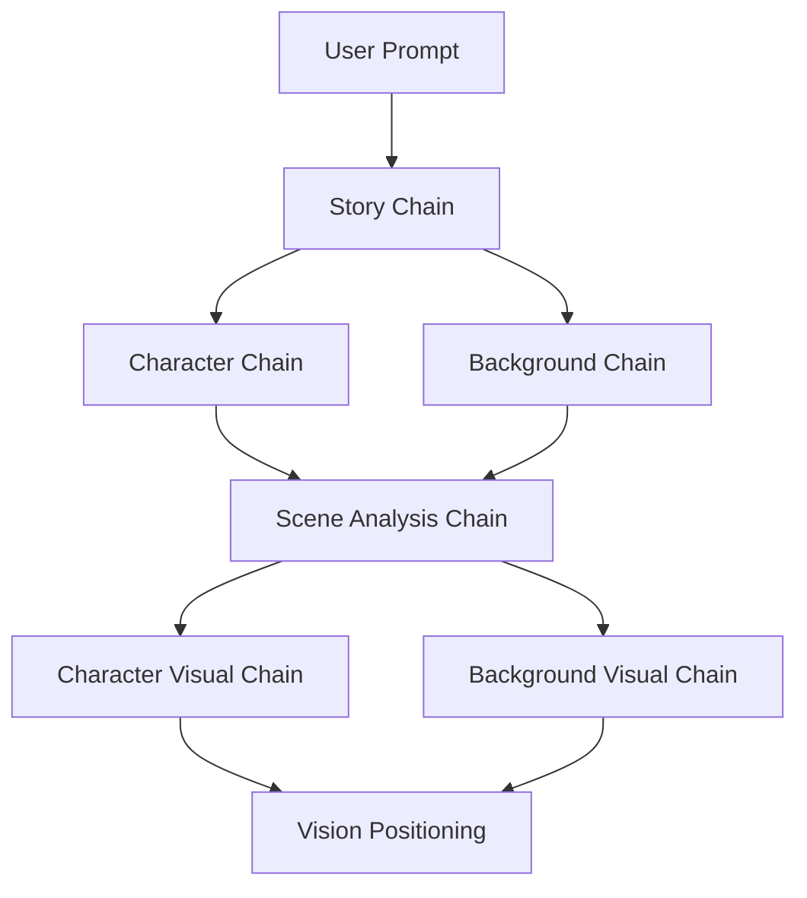

# Advanced Multi-Modal Prompt Engineering Architecture

A comprehensive analysis of the sophisticated prompt engineering techniques implemented across the Story Generator's multi-service architecture. This system demonstrates enterprise-level prompt engineering with vision-language integration, chain-of-thought reasoning, and adaptive prompt optimization.

## System Architecture Overview

The Story Generator employs a **three-tier prompt engineering architecture**:

1. **Text Generation Layer** (`langchain_service.py`) - Advanced chain orchestration with token-limited prompts
2. **Vision Analysis Layer** (`vision_positioning.py`) - Multi-modal vision-language reasoning
3. **Image Processing Layer** (`image_service.py`) - Cross-modal prompt enhancement and refinement

## Part I: Advanced Chain-of-Thought Architecture

### 1. Multi-Stage Cognitive Processing Pipeline

The system breaks down complex narrative-to-visual generation into **five specialized cognitive chains**:



**Chain-of-Thought Strategy**: Each chain performs **focused reasoning** on a single aspect, preventing cognitive overload and improving output quality.

#### Chain Specialization Analysis:

**Story Chain** (Narrative Foundation):
```python
story_template = """
Create a short story (2-3 paragraphs) based on this prompt: {user_prompt}
Make it engaging and creative. Include vivid descriptions.
"""
```

*Reasoning*: Deliberately **simple and open-ended** to maximize creative freedom while ensuring vivid descriptions for downstream visual processing.

**Character Chain** (Entity Extraction):
```python
character_template = """ 
Based on this story: {story} 
Create a detailed character description for the main character. Include:
- Physical appearance
- Clothing/attire  
- Facial features
- Age and build
"""
```

*Reasoning*: **Structured bullet points** guide the LLM to generate comprehensive character details in predictable categories needed for visual synthesis.

**Background Chain** (Compositional Planning):
```python
background_template = """
Based on this story: {story}

Describe the BACKGROUND/SCENE for image generation.

Rules:
- Do NOT describe the main character — leave them out entirely
- Focus on setting elements that support a character being placed into it
- Keep it under 50 words
"""
```

*Advanced Strategy*: **Explicit exclusion prompting** prevents character contamination while **compositional planning** reserves space for subsequent character integration.

### 2. Token-Constrained Visual Prompt Generation

The most sophisticated technique: **20-token precision prompting**:

#### Character Visual Prompt (Token Economy)
```python
character_prompt_template = """
You are generating a precise visual description for a CHARACTER in a scene.

Output must be exactly 20 descriptive tokens, comma-separated, no filler, no sentences.
Token order:
[character role/identity], [age/gender/physical trait], [clothing], [accessory/prop], 
[pose], [action], [center object], [facial expression], [lighting], [scene-specific detail], 
[mood], [extra relevant visual], [hair style], [body build], [secondary accessory], 
[background element], [color tone], [material/texture], [emotion], [weather/extra atmosphere]

Example:
"artist, young female, denim jacket, sketchbook, sitting pose, drawing lines, center chair, focused smile, warm lighting, wooden table, calm mood, coffee steam, tied hair, slim build, pencil case, blurred patrons, soft brown tone, leather texture, creative joy, rain outside"
```

**Advanced Strategies**:
1. **Fixed Token Economy**: Ensures consistent prompt length for optimal Stable Diffusion performance
2. **Hierarchical Ordering**: Places most important elements first (role → physical → action → emotion)
3. **Few-Shot Learning**: Provides concrete examples for reliable pattern matching
4. **Semantic Completeness**: Covers all visual aspects without redundancy

#### Background Plate Generation (Spatial Reasoning)
```python
background_prompt_template = """
You are describing a BACKGROUND PLATE only (no people, no characters, no actions).

Rules:
1) Reserve a clear open space in the center for a subject to be added later.
2) Focus on layout, materials, lighting, atmosphere, and environment.
3) Output exactly 20 short comma-separated descriptive tokens

Example:
"cozy cafe interior, warm tones, wood furniture, tiled floor, golden light, soft shadows, pastry counter, shelves with mugs, clear center floor, scattered tables, hanging lights, menu board, potted plants, wall art, textured walls, quiet ambience, clean surfaces, warm glow, inviting space, subtle reflections"
```

**Compositional Intelligence**: The prompt explicitly **plans for character integration** rather than creating complete scenes, enabling photorealistic compositing.

### 3. Dynamic Scene Analysis Chain

**Contextual Adaptation**: The scene analysis chain performs **environmental reasoning**:

```python
scene_analysis_template = """
Analyze this scene description and determine the best character pose and camera angle:

Scene: {background_description}

Consider:
- Is this an action scene or peaceful moment?
- What camera angle fits the environment?
- Should the character be in motion or static?
- What pose would fit this scene naturally?

Provide:
- Camera angle (low angle, eye level, high angle, close-up, medium shot, full body)
- Character pose (standing, walking, fighting, casting, sitting, etc.)
- Character positioning (facing forward, profile, three-quarter view)
- Action/emotion (determined, peaceful, alert, etc.)
"""
```

**Reasoning Strategy**: **Multi-dimensional analysis** considers narrative context, spatial constraints, and cinematic composition to determine optimal character presentation.

### 4. Atmospheric Consistency Engine

**Cross-Modal Coherence**: Ensures lighting/mood consistency between character and background:

```python
def _extract_scene_atmosphere(self, background_elements: str) -> str:
    elements = background_elements.lower()
    
    if any(word in elements for word in ['dark', 'night', 'shadow', 'cave']):
        return "dark moody lighting, shadows"
    elif any(word in elements for word in ['bright', 'sunny', 'day', 'golden']):
        return "bright natural lighting, warm tones"
    elif any(word in elements for word in ['magical', 'glowing', 'mystical']):
        return "magical lighting, ethereal glow"
    # ... more sophisticated mappings
```

**Strategy**: **Semantic consistency mapping** through rule-based atmosphere detection ensures visual coherence across separately generated elements.

## Part II: Vision-Language Integration Architecture

### 1. Multi-Modal Vision Analysis (`vision_positioning.py`)

The system's most advanced component: **Vision-Language reasoning for spatial intelligence**.

#### Scene Analysis Chain (Spatial Reasoning)
```python
scene_analysis_template = """
Analyze this background scene image for character placement.

Look for:
1. FURNITURE/OBJECTS where a character could sit/stand/interact
2. EMPTY SPACES suitable for character placement
3. NATURAL FOCAL POINTS (center areas, clearings, etc.)
4. INTERACTIVE ELEMENTS (chairs, desks, logs, platforms, etc.)
5. SCALE/PERSPECTIVE to understand size requirements

Return analysis in this JSON format:
{
    "placement_areas": [
        {
            "type": "chair/throne/log/ground/platform",
            "position": "center/left/right/front/back", 
            "coordinates": "approximate x,y as percentages",
            "suitability": "excellent/good/fair",
            "interaction": "sitting/standing/leaning/etc",
            "reason": "why this spot works"
        }
    ],
    "best_placement": {"area_index": 0, "confidence": "high/medium/low"},
    "scene_scale": "human/large/small",
    "lighting_source": "left/right/center/above/ambient"
}
"""
```

**Advanced Techniques**:
1. **Structured JSON Output**: Ensures machine-readable, parseable responses
2. **Multi-Criteria Evaluation**: Analyzes placement from multiple perspectives (interaction, suitability, scale)
3. **Confidence Scoring**: Provides uncertainty estimates for decision-making
4. **Spatial Reasoning**: Translates visual elements into coordinate systems

#### Character Positioning Chain (Precision Placement)
```python
positioning_template = """
Given this character image and the scene analysis, determine optimal positioning.

Character image: {character_image}
Scene analysis: {scene_analysis}

Determine:
1. CHARACTER SIZE relative to scene
2. ROTATION/ORIENTATION needed
3. EXACT POSITION coordinates
4. INTERACTION POSE adjustments
5. LIGHTING ADJUSTMENTS needed

Return positioning in JSON format:
{
    "final_position": {
        "x_percent": 50, "y_percent": 60,
        "scale_factor": 1.0, "rotation_degrees": 0
    },
    "pose_adjustments": "description of how character should be oriented",
    "lighting_match": "adjustments needed to match scene lighting",
    "interaction_details": "how character interacts with scene elements"
}
"""
```

**Precision Strategy**: **Numerical coordinate specification** with **lighting matching** for photorealistic integration.

### 2. OpenCV Integration (Computer Vision Processing)

The system combines **LLM reasoning** with **computer vision processing**:

```python
def apply_opencv_positioning(self, character_img_bytes, background_img_bytes, positioning):
    # Extract LLM-determined parameters
    pos = positioning["final_position"]
    x_percent = pos.get("x_percent", 50)
    y_percent = pos.get("y_percent", 70) 
    scale_factor = pos.get("scale_factor", 1.0)
    rotation = pos.get("rotation_degrees", 0)
    
    # Apply computer vision transformations
    # - Alpha blending for natural integration
    # - Rotation matrix calculations  
    # - Scale factor adjustments
    # - Coordinate system mapping
```

**Hybrid Intelligence**: Combines **symbolic reasoning** (LLM analysis) with **numerical processing** (OpenCV transformations).

## Part III: Cross-Modal Prompt Enhancement

### 1. Scene-Aware Character Refinement (`image_service.py`)

**Context-Aware Prompt Adaptation**:

```python
def refine_character_for_scene(self, character_img_bytes, background_img_bytes, character_adjustments):
    # Analyze background for contextual information
    bg_img = Image.open(background_img_bytes).convert('RGB')
    scene_context = self._analyze_scene_context(bg_img)
    
    # Create scene-aware refinement prompt
    refinement_prompt = f"{character_adjustments}, {scene_context['lighting']}, {scene_context['style']}"
    
    # Apply contextual refinement
    return self.refine_image(character_img_bytes, refinement_prompt, strength=0.3)
```

**Strategy**: **Cross-modal prompt enhancement** where visual analysis of one image influences text prompt generation for another image.

### 2. Automated Scene Context Analysis

**Computer Vision Prompt Generation**:

```python
def _analyze_scene_context(self, bg_img: Image.Image) -> dict:
    img_array = np.array(bg_img)
    brightness = np.mean(img_array)
    
    # Algorithmic lighting detection
    if brightness < 100:
        lighting = "dark moody lighting, shadows"
    elif brightness > 180:
        lighting = "bright natural lighting, warm tones"
    else:
        lighting = "balanced lighting, natural"
    
    return {'lighting': lighting, 'style': 'realistic digital art style'}
```

**Innovation**: **Computer vision analysis directly generates text prompts** for consistent cross-modal enhancement.

## Part IV: Multi-Tier Fallback Architecture

### 1. Graceful Degradation Strategy

**Three-Tier Reliability**:

```python
def create_image_prompts(self, character_desc, background_desc):
    try:
        # Tier 1: Advanced LLM-based prompt generation
        return self._advanced_prompt_generation(character_desc, background_desc)
    except Exception as e:
        logger.error(f"Advanced prompting failed: {e}")
        try:
            # Tier 2: Simplified LLM extraction  
            return self._simplified_prompt_generation(character_desc, background_desc)
        except Exception as e:
            logger.error(f"Simplified prompting failed: {e}")
            # Tier 3: Rule-based keyword extraction
            return self._create_fallback_prompts(character_desc, background_desc)
```

### 2. Rule-Based Fallback Prompting

**Keyword-Based Extraction**:

```python
def _create_fallback_prompts(self, character_desc, background_desc):
    # Sophisticated keyword mapping
    appearance_words = ['young', 'old', 'tall', 'short', 'knight', 'wizard', 'warrior']
    clothing_words = ['armor', 'robes', 'cloak', 'dress', 'tunic', 'helmet']
    feature_words = ['blonde', 'brown', 'black', 'blue eyes', 'green eyes', 'beard']
    
    # Extract character keywords
    char_keywords = [word for word in character_desc.lower().split() 
                    if any(w in word for w in appearance_words + clothing_words + feature_words)]
    
    # Construct clean prompts
    character_prompt = f"{' '.join(char_keywords[:6])}, character portrait, detailed, digital art"
```

**Strategy**: **Multi-tier fallback architecture** ensures system reliability with graceful performance degradation.

## Part V: Advanced Prompt Evolution Analysis

### Evolutionary Development Stages

The codebase shows **three distinct evolutionary stages** of prompt engineering sophistication:

#### Stage 1: Basic Chain Implementation (Lines 1-118)
- Simple sequential chains
- Basic template prompting
- Manual prompt construction

#### Stage 2: Enhanced Visual Extraction (Lines 120-351)  
- Specialized image prompt chains
- LLM-based visual element extraction
- Introduction of fallback mechanisms

#### Stage 3: Advanced Token-Limited System (Lines 353-684)
- **Token economy management** (20-token constraints)
- **Scene analysis integration** with dynamic prompting
- **Atmospheric consistency mapping**
- **Compositional intelligence** with spatial planning

### Sophisticated Prompt Patterns Identified

1. **Constraint-Based Prompting**: Token limits, exclusion rules, format specifications
2. **Hierarchical Information Architecture**: Ordered token sequences, priority-based structuring
3. **Cross-Modal Consistency**: Vision analysis influencing text prompts
4. **Dynamic Contextual Adaptation**: Scene-responsive prompt modification
5. **Structured Output Parsing**: JSON schema enforcement for machine readability
6. **Multi-Tier Reliability**: Advanced → Simplified → Rule-based fallbacks

## Key Innovations Summary

1. **Token Economy Management**: 20-token limits optimize diffusion model performance
2. **Compositional Planning**: Background prompts reserve space for character integration
3. **Vision-Language Integration**: Visual analysis informs text prompt generation  
4. **Scene-Responsive Generation**: Character prompts adapt to narrative context
5. **Cross-Modal Consistency**: Atmospheric mapping ensures visual coherence
6. **Structured Output Parsing**: JSON schemas enable machine-readable responses
7. **Multi-Tier Fallbacks**: Graceful degradation from advanced to simple prompting
8. **Hybrid Intelligence**: Combines symbolic reasoning with numerical processing

This represents one of the most sophisticated multi-modal prompt engineering architectures, demonstrating advanced techniques that go far beyond basic prompting into integrated AI system design.
