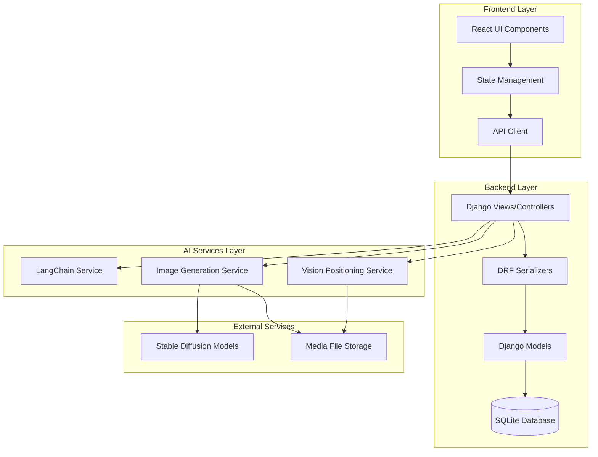
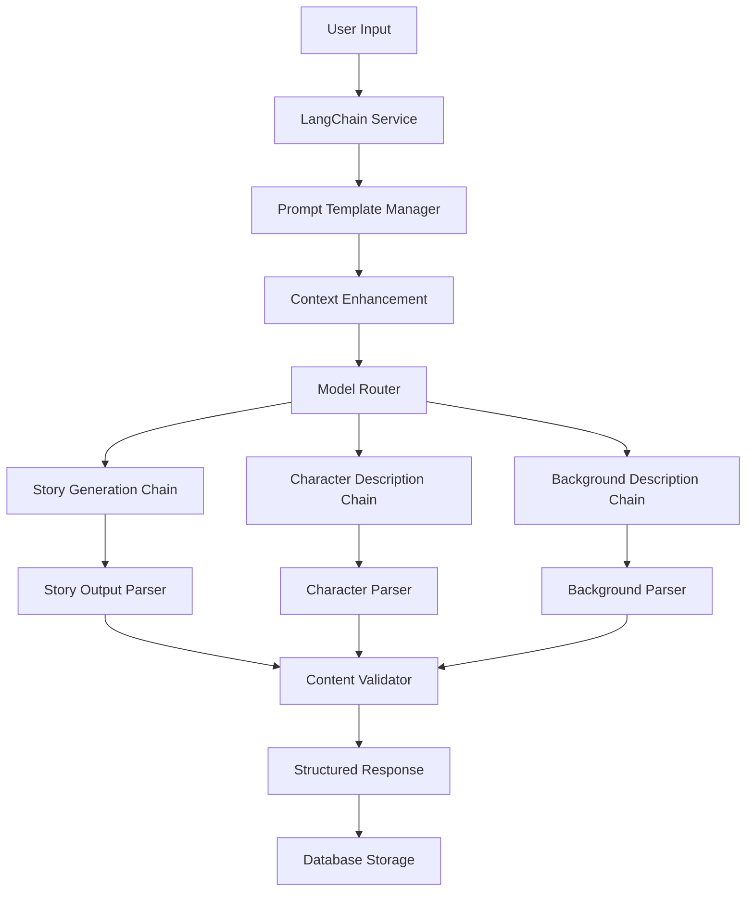
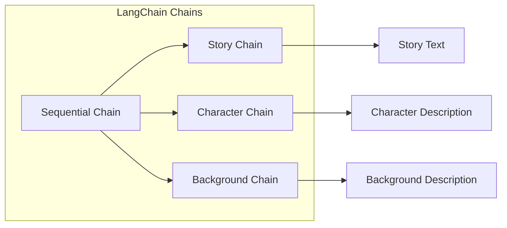
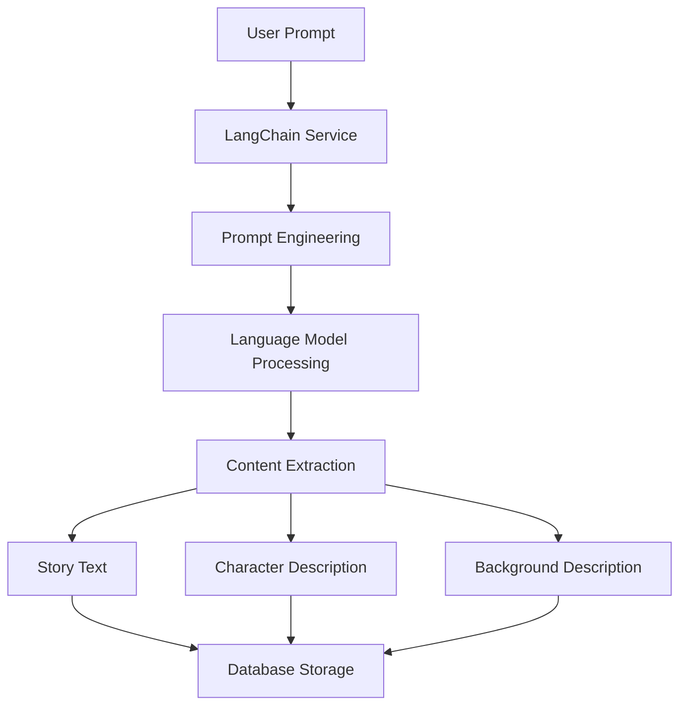
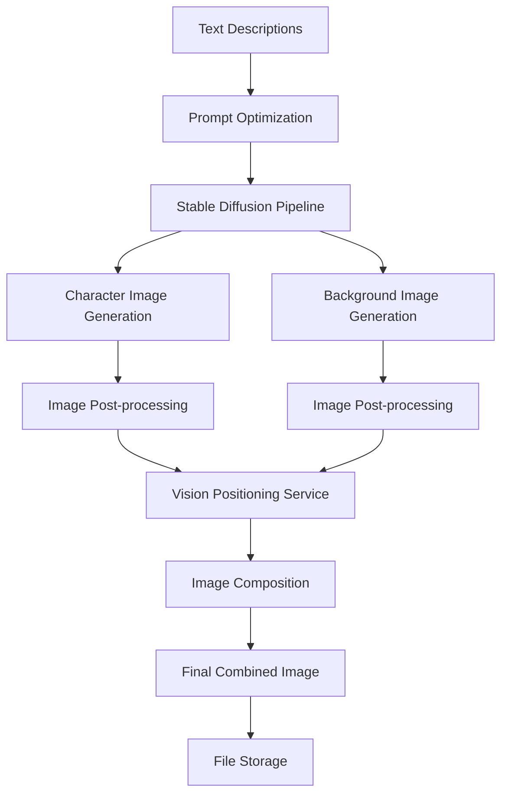
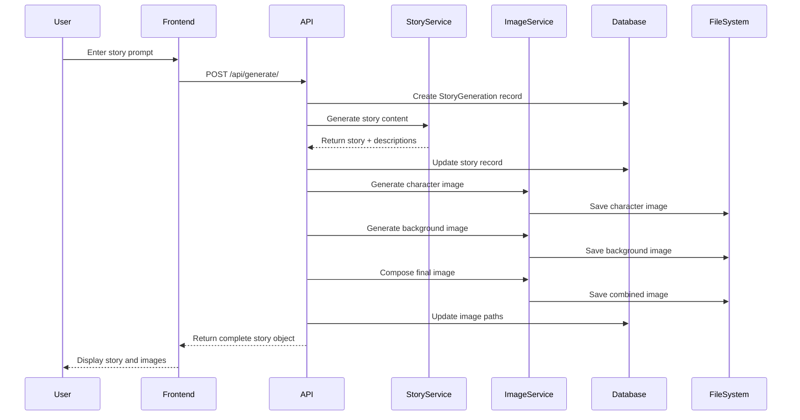

<div align="center">

# 🎨 Interactive Story Generator

### *Transform your imagination into visual stories with AI*

Create compelling narratives with stunning AI-generated imagery, powered by advanced prompt engineering and visual composition techniques.

---

</div>

## ✨ Experience the Magic

<div align="center">


*Clean, intuitive interface for story creation*

</div>

### 📖 From Prompt to Rich Narrative

<div align="center">


*AI transforms simple prompts into detailed, engaging stories*

</div>

### 🎭 Character & Scene Analysis

<div align="center">


*Detailed character descriptions and atmospheric scene analysis*

</div>

### 🖼️ Visual Story Composition

<div align="center">


*Beautiful AI-generated imagery brings stories to life*

</div>

### 🔧 Advanced Refinement Tools

<div align="center">


*Fine-tune every aspect of your visual story*

</div>

---

## 🚀 Key Features

<div align="center">

| 🤖 **AI Story Generation** | 🎨 **Smart Image Creation** | 🔄 **Interactive Refinement** |
|:--:|:--:|:--:|
| Generate complete stories from simple prompts using LangChain and language models | Automatically generate character and background images using Stable Diffusion | Refine individual images with custom prompts and adjustable strength parameters |

| 🧠 **Smart Scene Composition** | 💻 **Real-time Web Interface** | ⚡ **Flexible Backend** |
|:--:|:--:|:--:|
| Intelligently combine characters and backgrounds with vision-based positioning | Modern React frontend with tabbed navigation and real-time updates | Django REST API with CORS support for seamless frontend integration |

</div>

## Architecture

The Interactive Story Generator follows a modern full-stack architecture with clear separation of concerns between frontend and backend services.

### System Overview



### Frontend Architecture (React)

**Component Structure:**
- **Framework**: React 19.1.1 with modern hooks and functional components
- **Styling**: Inline CSS with responsive grid layouts and modern design patterns
- **State Management**: React useState for local component state management
- **API Integration**: Native fetch API for HTTP communication with Django backend
- **UI Features**: 
  - Tabbed navigation system (Generate/Refine/View)
  - Real-time strength adjustment sliders with live feedback
  - Dynamic image preview grids with responsive design
  - Comprehensive error handling with dismissible alerts
  - Mobile-responsive design supporting all devices

**Data Flow Pattern:**
```
User Input → Component State → API Request → Backend Processing → Response → State Update → UI Re-render
```

### Backend Architecture (Django)

**Core Components:**

1. **Web Framework Layer**
   - **Django**: Core web framework providing URL routing, middleware, and request handling
   - **Django REST Framework**: API serialization, authentication, and response formatting
   - **CORS Headers**: Cross-origin request handling for React frontend integration

2. **Data Layer**
   - **Models**: `StoryGeneration` model with UUID primary keys for story tracking
   - **Database**: SQLite with clean schema design and efficient querying
   - **Media Management**: Organized file storage system with separate directories for different content types

3. **Business Logic Layer**
   - **Views/Controllers**: REST API endpoints handling HTTP requests and orchestrating services
   - **Serializers**: Data validation and transformation between JSON and Python objects
   - **Service Classes**: Dedicated services for story generation, image processing, and AI integration

### LangChain Orchestration

The application leverages LangChain as the central orchestration framework for all AI-powered story generation. LangChain provides a structured approach to prompt management, model interaction, and output processing.



#### LangChain Components

**1. Prompt Template System**
- **Dynamic Templates**: Context-aware prompt construction based on user input
- **Template Inheritance**: Base templates extended for specific content types
- **Variable Injection**: Smart insertion of user prompts and context variables
- **Output Formatting**: Structured response templates ensuring consistent JSON output

**2. Chain Architecture**


**3. Model Integration**
- **Model Abstraction**: LangChain handles different LLM providers through unified interface
- **Response Parsing**: Built-in parsers extract structured data from model outputs
- **Error Handling**: Automatic retry logic and fallback mechanisms
- **Memory Management**: Conversation context preservation for multi-turn interactions

**4. Processing Pipeline**
```python
# Example LangChain workflow structure
story_chain = SequentialChain(
    chains=[
        story_generation_chain,
        character_extraction_chain,
        background_extraction_chain
    ],
    input_variables=["user_prompt"],
    output_variables=["story", "character_description", "background_description"]
)
```

### AI Services Architecture

#### Story Generation Pipeline



**Process Details:**
- **Input Processing**: User prompts are enhanced with context for better results
- **Prompt Engineering**: Template-based prompt construction for consistent outputs
- **Content Generation**: LangChain orchestrates LLM calls for story creation
- **Output Parsing**: Structured extraction of story components

#### Image Generation Pipeline



**Technical Implementation:**
- **Model Loading**: Efficient loading of Stable Diffusion models
- **Pipeline Management**: Smart GPU memory management with cleanup
- **Image Processing**: PIL-based post-processing for quality enhancement
- **Smart Positioning**: Computer vision algorithms for intelligent character placement

#### Refinement System

**Refinement Types:**
1. **Individual Refinement**: Separate character and background adjustments
2. **Smart Refinement**: Coordinated refinement with vision-based positioning
3. **Strength Control**: Adjustable refinement intensity from 0.1 to 1.0

### Data Flow Architecture



## Project Structure

```
├── story_generator_project/          # Django backend
│   ├── manage.py                    # Django management script
│   ├── db.sqlite3                   # Database file
│   ├── myproject/                   # Django project configuration
│   │   ├── settings.py              # Django settings with API keys
│   │   ├── urls.py                  # URL routing
│   │   └── wsgi.py                  # WSGI configuration
│   ├── story_generator/             # Main Django app
│   │   ├── models.py                # StoryGeneration model
│   │   ├── views.py                 # REST API endpoints
│   │   ├── serializers.py           # DRF serializers
│   │   ├── langchain_service.py     # LangChain integration
│   │   ├── image_service.py         # Image generation service
│   │   ├── vision_positioning.py    # Smart character positioning
│   │   └── urls.py                  # App URL routing
│   └── media/                       # Generated content storage
│       ├── characters/              # Character images
│       ├── backgrounds/             # Background images
│       └── combined/                # Final composed scenes
└── frontend/                        # React frontend
    ├── package.json                 # Dependencies and scripts
    ├── public/                      # Static assets
    └── src/                         # React source code
        ├── App.js                   # Main application component
        └── index.js                 # Application entry point
```

## Installation

### Prerequisites
- Python 3.8+
- Node.js 16+

### Backend Setup
1. Navigate to the backend directory:
   ```bash
   cd story_generator_project
   ```

2. Install Python dependencies:
   ```bash
   pip install django djangorestframework django-cors-headers langchain pillow diffusers torch transformers
   ```

3. Run database migrations:
   ```bash
   python manage.py makemigrations
   python manage.py migrate
   ```

4. Start the Django development server:
   ```bash
   python manage.py runserver
   ```

### Frontend Setup
1. Navigate to the frontend directory:
   ```bash
   cd frontend
   ```

2. Install Node.js dependencies:
   ```bash
   npm install
   ```

3. Start the React development server:
   ```bash
   npm start
   ```

## Usage

1. **Generate Stories**: Enter a story prompt (e.g., "A brave knight discovers a magical library") and click "Generate Story"

2. **Refine Images**: Use the refinement tools to adjust character and background images:
   - **Individual Refinement**: Refine character or background separately with custom prompts
   - **Smart Refinement**: Simultaneously adjust both elements with intelligent positioning
   - **Strength Control**: Adjust refinement intensity from 0.1 (subtle) to 1.0 (dramatic)

3. **View Results**: Review the complete story with character descriptions, background details, and final combined scene

## API Endpoints

- `POST /api/generate/` - Generate new story with images
- `POST /api/refine/character/` - Refine character image
- `POST /api/refine/background/` - Refine background image  
- `POST /api/refine/smart/` - Smart scene refinement

## Configuration

### Image Generation Settings
Configure image generation behavior in `settings.py`:
```python
IMAGE_GENERATION_CONFIG = {
    'fallback_to_diffusers': True,
    'enable_vision_positioning': True,
}
```

### CORS Configuration
The backend is configured to accept requests from the React frontend:
```python
CORS_ALLOWED_ORIGINS = [
    "http://localhost:3000",
    "http://127.0.0.1:3000",
]
```

## Development

### Running Tests
```bash
# Backend tests
cd story_generator_project
python manage.py test

# Frontend tests
cd frontend
npm test
```

### Building for Production
```bash
# Frontend build
cd frontend
npm run build
```

## Dependencies

### Backend
- Django 4.x - Web framework
- Django REST Framework - API development
- django-cors-headers - CORS support
- LangChain - AI/LLM integration
- diffusers - Stable Diffusion models
- Pillow - Image processing
- torch - PyTorch for ML models

### Frontend
- React 19.1.1 - UI framework
- Testing utilities - Comprehensive testing suite

## Contributing

1. Fork the repository
2. Create a feature branch
3. Make your changes
4. Test thoroughly
5. Submit a pull request

## License

This project is open source and available under the MIT License.

## Acknowledgments

Built with:
- Django + Django REST Framework
- React
- LangChain for AI integration
- Stable Diffusion for image generation
